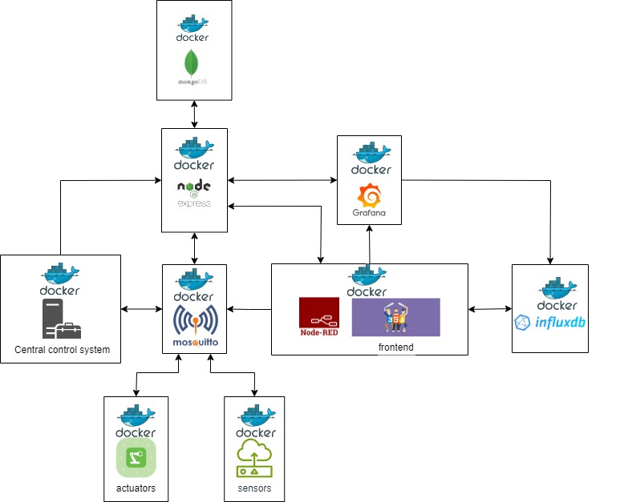

# Smart Light System for Home

## Introduction

This project is a smart light system for home. It is a simple project that can be used to control the lights in your home. The system is designed to be controlled by dashboard. The system is designed to be simple and easy to use.

## Features

- Control the lights in your home from the dashboard
- Set the minimum and maximum brightness of the lights
- Turn all the lights off

## Hardware

The sensors and actuators used in this project are simulated using Node.js. The sensors and actuators are the following:

- Light sensor
- Motion sensor
- Light Bulb

## Software

- Node.js
- Express
- Node-RED
- Docker
- Mosquitto
- MongoDB
- Grafana
- InfluxDB
- PostgreSQL

## Architecture

The architecture of the system is the following:

### Sensors and actuators

The sensors and actuators are simulated using Node.js

### Server (backend)

The server is implemented using Node.js and Express, it is used to get and update the user preferences and to create a new dashboard on grafana for every sensor and actuator added to the system.

The user preferences are stored in a MongoDB database.

### Grafana

Grafana is used to create the dashboards for the sensors and actuators. The dashboards are created using the Grafana API.

### PostgreSQL

PostgreSQL is used to store the data of grafana.

### Influxdb

Influxdb is used to store the data of the sensors and actuators.

### Node-RED

Node-RED is used to create the flows of the system. The flows are used to listen for sensor and actuators data and to store it in the Influxdb database.

It is also used to create the dashboard for the user to control the lights and to monitor the sensors and actuators.

### Mosquitto

Mosquitto is used to create the MQTT broker for the system. The sensors and actuators use MQTT to communicate with the server and with Node-RED.

### Central control system

The central control system is implemented using Node.js. It is used to register the sensors and actuators in the system and to create the dashboards for them in Grafana. It is also used to get and update the user preferences.

It is responsible of evaluating the sensors data by using the user preferences and to send the commands to the actuators.

## Requirements

- Docker

## Installation

- Clone the repository `git clone <https://github.com/BryantSarabia/SE4IOT.git>`
- Run `docker-compose up`
- Open the web browser and go to <http://localhost:1880/ui>

## Usage

- Open the [nodered dashboard](http://localhost:1880/ui)
- Use the dashboard to set the minimum and maximum brightness of the lights
- Use the dashboard to monitor the light sensor and motion sensor values
- Use the dashboard to monitor the current consumption of the lights
- Use the dashboardto monitor the total energy consumption of the lights in the last 30 days

## Authors

- Bryant Michelle Sarabia Ortega
